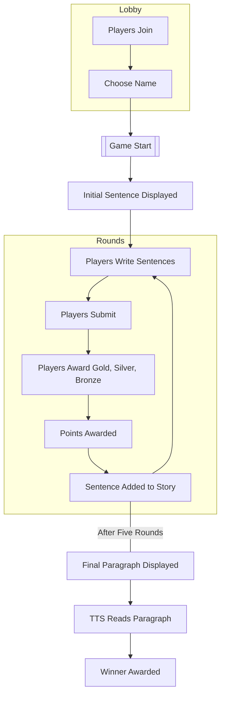

```mermaid
flowchart
    subgraph Lobby
        lobby_join[Players Join] --> lobby_name[Choose Name]
    end
    lobby_name --> game_start[[Game Start]]
    game_start --> initial[Initial Sentence Displayed]
    initial --> players_write
    subgraph Rounds
        players_write[Players Write Sentences] --> players_submit[Players Submit]
        players_submit --> players_vote[Players Award Gold, Silver, Bronze]
        players_vote --> points[Points Awarded]
        points --> sentence_added[Sentence Added to Story]
        sentence_added --> players_write
    end
    sentence_added -- After Five Rounds --- final_paragraph[Final Paragraph Displayed]
    final_paragraph --> read_paragraph[TTS Reads Paragraph]
    read_paragraph --> winner[Winner Awarded]
```